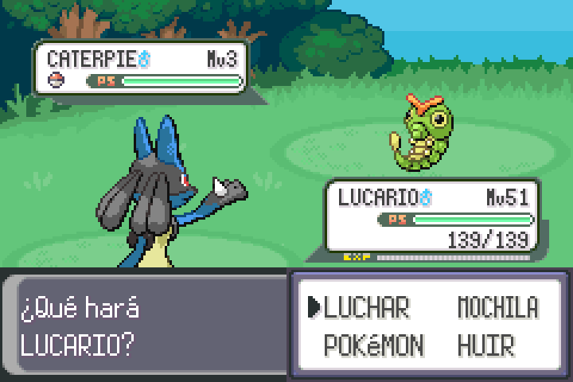
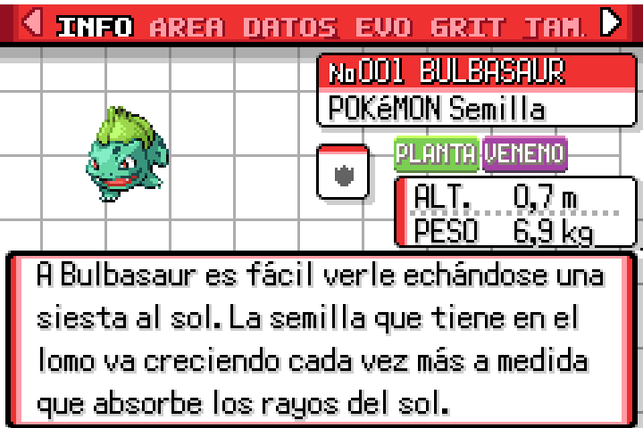
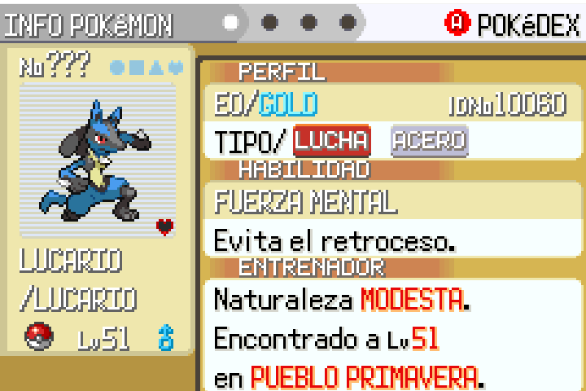
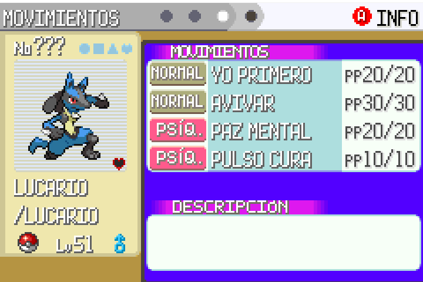
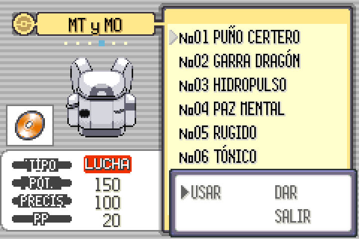
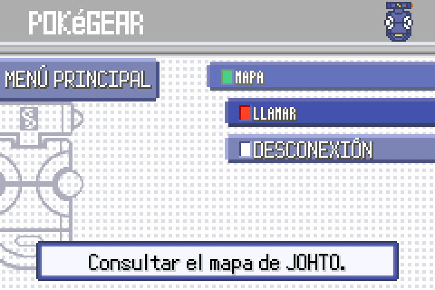

# Pokémon Heart & Soul — Traducción al castellano

**Heart & Soul en castellano** es la traducción al español de [**Pokémon Heart & Soul**](https://github.com/PokemonHnS-Development/pokehns-expansion), el *romhack* de GBA que recrea Pokémon Oro/Plata/Cristal (y adapta Oro HeartGold/Plata SoulSilver) sobre el motor de Pokémon Esmeralda.

Este repositorio es un *fork* del código fuente original (**v2.0.6**) con todo el juego traducido: diálogos, menús, objetos, movimientos, habilidades, Pokédex, nombres de lugares y personajes, y los gráficos que contienen texto.

  
  

  
  

  
  

---

## 📥 Cómo jugar

**No se distribuye ninguna ROM.** Solo el parche, que se aplica sobre tu propia copia legal de Pokémon Esmeralda.

1. Descarga **`Pokemon_HnS_ES.ups`** desde la [última release](../../releases/latest).
2. Abre [Rom Patcher JS](https://www.marcrobledo.com/RomPatcher.js/), carga tu ROM de **Pokémon Esmeralda en inglés (U)** y aplica el parche.
   - ⚠️ **No uses la Esmeralda española ni la alemana**: el parche solo funciona con la versión inglesa.
   - ROM de origen: 16.777.216 bytes, CRC32 `1F1C08FB`.
   - ROM resultante: 33.554.432 bytes, CRC32 `E8D8C504`.
3. Juega en un emulador preciso: **mGBA** en PC/Mac/Linux, o alternativas equivalentes en móvil.
   - ❌ **MyBoy no funciona.**

> Las partidas guardadas de versiones anteriores a la 2.0 del juego original no son compatibles.

## 🌍 Qué está traducido

- Todos los textos del juego: diálogos de historia y de personajes, combates, menús, mochila, ficha de entrenador, PC, Pokégear, opciones…
- Nombres de objetos, movimientos, habilidades, tipos, naturalezas y categorías de la Pokédex.
- **Gráficos con texto**: iconos de tipo, cabeceras de la ficha del Pokémon, menú de equipo, barras de vida (PS / Nv), iconos de estado, Pokédex, Pokégear, teclado de nombres, tarjeta de entrenador y Pase del Frente, entre otros.
- Ajustes en el código para que el español funcione bien: concordancias y artículos en los mensajes de combate, límites de texto de los recuadros, letras acentuadas y signos de apertura (¿ ¡).

Criterios de traducción: se mantiene el estilo de las ediciones españolas de Esmeralda (nombres en MAYÚSCULAS como POKéMON o ENTRENADOR) y, para el contenido de Johto, la terminología de las ediciones españolas de HeartGold/SoulSilver.

## ⚠️ Estado

Versión actual de la traducción: **1.1** (correcciones de textos sin traducir y de recuadros). Se ha probado en emulador, pero un juego tan grande puede esconder textos pendientes, recuadros ajustados o erratas. Si encuentras algo, indica en qué parte del juego estabas y adjunta una captura.

## 🛠️ Compilar desde el código

La rama `master` de este fork contiene el código fuente con la traducción. Para compilarlo sigue la guía original, [`INSTALL.md`](INSTALL.md) (en inglés).

> ❗ No uses «Download ZIP» de GitHub: no incluye el historial de commits.

## ℹ️ Sobre el proyecto original

[**`pokemonHnS-expansion`**](https://github.com/PokemonHnS-Development/pokehns-expansion), también conocido como *Pokémon Heart and Soul 2.0*, es a la vez un *remake* de GSC y un *demake* de HGSS, con mejoras de calidad de vida y personalización. Se construye sobre:

- [**Modern Emerald**](https://github.com/resetes12/pokeemerald) de resetes12.
- [**pokeemerald-expansion**](https://github.com/rh-hideout/pokeemerald-expansion) de RHH (Rom Hacking Hideout).
- [**pokeemerald**](https://github.com/pret/pokeemerald), el proyecto de descompilación de pret.

Documentación y características del juego original (en inglés):

- [`FEATURES.md`](FEATURES.md) y [`AVAILABLE_FEATURES.md`](AVAILABLE_FEATURES.md)
- [Documentación para jugadores](https://pokemonhns-development.github.io/pokehns-expansion-documentation/)
- [Servidor de Discord de Pokémon Heart and Soul](https://discord.gg/ksNTFNSBj)
- README original completo: [`README_ORIGINAL_EN.md`](README_ORIGINAL_EN.md)

## 🙏 Créditos

- **Equipo de Pokémon Heart & Soul** (PokemonHnS-Development): el juego, el código y los gráficos originales. Consulta [`CREDITS.md`](CREDITS.md) para la lista completa de colaboradores.
- **RHH, pret, resetes12** y todos los autores de las bases sobre las que se construye.
- Para las convenciones de traducción se han consultado como referencia las ediciones oficiales españolas de Esmeralda y HeartGold. Parte de los gráficos con texto traducido proceden de la Esmeralda española oficial, y el resto se ha rehecho a mano.
- Hay un fork alemán equivalente, [`hns_de`](https://github.com/helikoptermann843/hns_de), que sirvió de modelo para esta publicación.
- La traducción y las herramientas de apoyo se han desarrollado con ayuda de Claude (Anthropic); el resultado se ha probado en emulador.

Si usas este trabajo, por favor mantén la cadena de créditos: **Pokémon Heart & Soul → pokeemerald-expansion (RHH) → pokeemerald (pret)**.

---

*Pokémon es una marca registrada de Nintendo, Game Freak y Creatures Inc. Este proyecto es un trabajo de aficionados sin ánimo de lucro, no está afiliado a ellas y **no incluye ni distribuye ninguna ROM**.*
